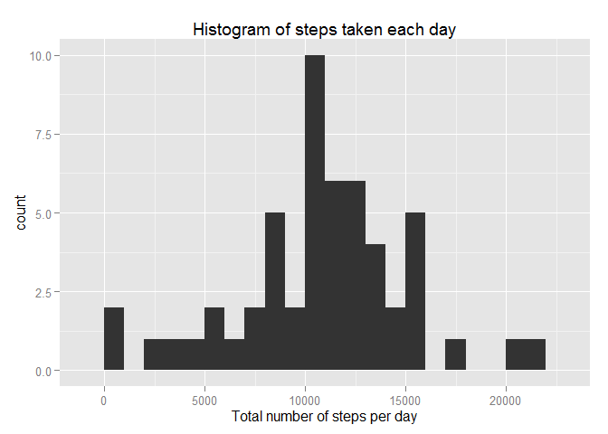
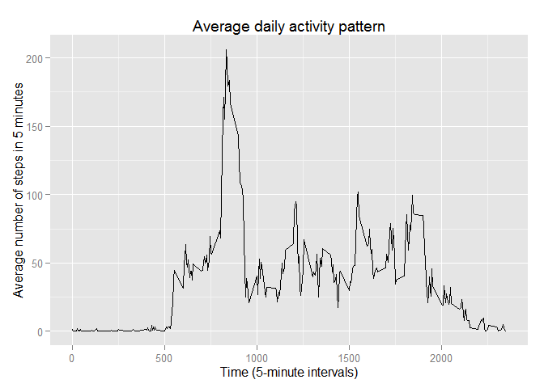
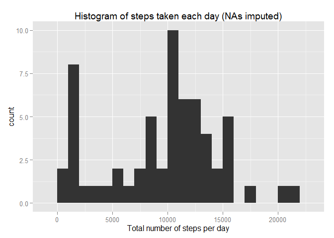
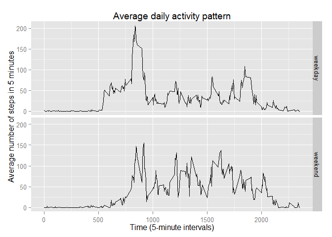

# Reproducible Research: Peer Assessment 1

## Loading and preprocessing the data
Loading the data from the zip file.

```r
file <- unz("activity.zip", "activity.csv")
activity <- read.csv(file)
```

What does it look like?

```r
str(activity)
```

```
## 'data.frame':	17568 obs. of  3 variables:
##  $ steps   : int  NA NA NA NA NA NA NA NA NA NA ...
##  $ date    : Factor w/ 61 levels "2012-10-01","2012-10-02",..: 1 1 1 1 1 1 1 1 1 1 ...
##  $ interval: int  0 5 10 15 20 25 30 35 40 45 ...
```

## What is mean total number of steps taken per day?

```r
stepsperday <- tapply(activity$steps, activity$date, sum)
library(ggplot2)
qplot(stepsperday, binwidth = 1000, main = "Histogram of steps taken each day",
     xlab = "Total number of steps per day")
```

 

Mean and median of steps for each day

```r
mean(stepsperday, na.rm = T)
```

```
## [1] 10766.19
```

```r
median(stepsperday, na.rm = T)
```

```
## [1] 10765
```

## What is the average daily activity pattern?

```r
qplot(interval, steps, data = activity, stat = "summary", fun.y = "mean", geom = "line",
     xlab = "Time (5-minute intervals)", ylab = "Average number of steps in 5 minutes",
     main = "Average daily activity pattern")
```

```
## Warning: Removed 2304 rows containing missing values (stat_summary).
```

 

Which 5-minute interval, on average across all the days in the dataset,
contains the maximum number of steps?

```r
intervalmeans <- tapply(activity$steps, activity$interval, mean, na.rm = T)
maxsteps <- sort(intervalmeans, decreasing = T)[1]
```
835 with 206.1698113 steps.

## Imputing missing values
How many missing values are there in the dataset?

```r
apply(activity, 2, function(x) sum(is.na(x)))
```

```
##    steps     date interval 
##     2304        0        0
```

Only the steps variable has missing values.

Impute the missing values by using the median of the 5-minute interval and
create a new data frame with the imputed values.

```r
intervalmedians <- tapply(activity$steps, activity$interval, median, na.rm = T)
activity_imp <- activity
for (i in 1:nrow(activity)) {
    if (is.na(activity$steps[i])) {
        activity_imp$steps[i] <-
            intervalmedians[[as.character(activity$interval[i])]]
    }
}
```

Update the histogram with the imputed values

```r
stepsperday_imp <- tapply(activity_imp$steps, activity_imp$date, sum)
qplot(stepsperday_imp, binwidth = 1000, main = "Histogram of steps taken each day (NAs imputed)",
     xlab = "Total number of steps per day")
```

 

A bar at the lower end of the distribution value appears...

Update the mean and median of steps for each day

```r
mean(stepsperday_imp)
```

```
## [1] 9503.869
```

```r
median(stepsperday_imp)
```

```
## [1] 10395
```

Many of the imputed values for the intervals are now zero. Because of this, mean
and median decrease and move apart from each other.

## Are there differences in activity patterns between weekdays and weekends?
Create a new factor variable that indicates whether the steps are taken on a
weekday or the weekend.

```r
activity_imp$weekdayweekend <- as.factor(weekdays(as.Date(activity_imp$date)))
levels(activity_imp$weekdayweekend) <- c(rep("weekday", 5), rep("weekend", 2))
```

Plot the timeseries separately for weekdays and weekends.

```r
qplot(interval, steps, data = activity_imp, geom = "line", stat = "summary",
    fun.y = "mean", facets = (weekdayweekend ~ .),
    xlab = "Time (5-minute intervals)",
    ylab = "Average number of steps in 5 minutes",
    main = "Average daily activity pattern")
```

 

This shows that activity is more evenly spread out over the day at the weekend.
